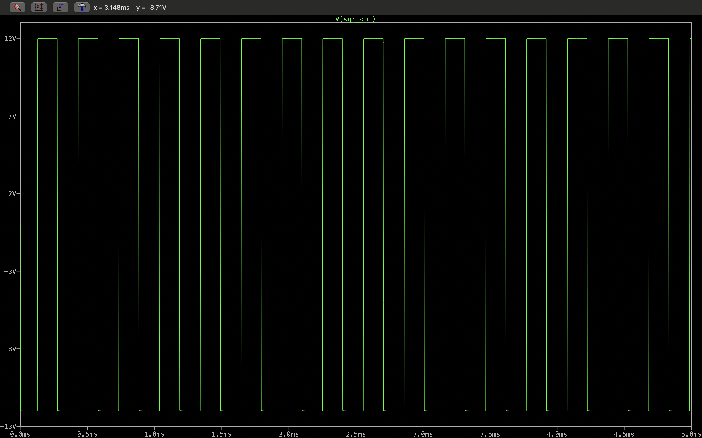

# Precision Oscillator Project

## Description
Designed a closed-loop feedback system to stabilize a custom Op-Amp and MOSFET-based Voltage Controlled Oscillator (VCO). Implemented an analog PID controller to ensure high stability.

## Simulation Results

## How to Run
1. Download the `.asc` file.
2. Open it in LTspice XVII.
3. Click 'Run'.# Precision-Oscillator
Designed a closed-loop precision oscillator using a custom Op-Amp/MOSFET VCO and NE555 frequency-to-voltage converter. Features an analog PID controller to dynamically minimize frequency drift and ensure stability.
